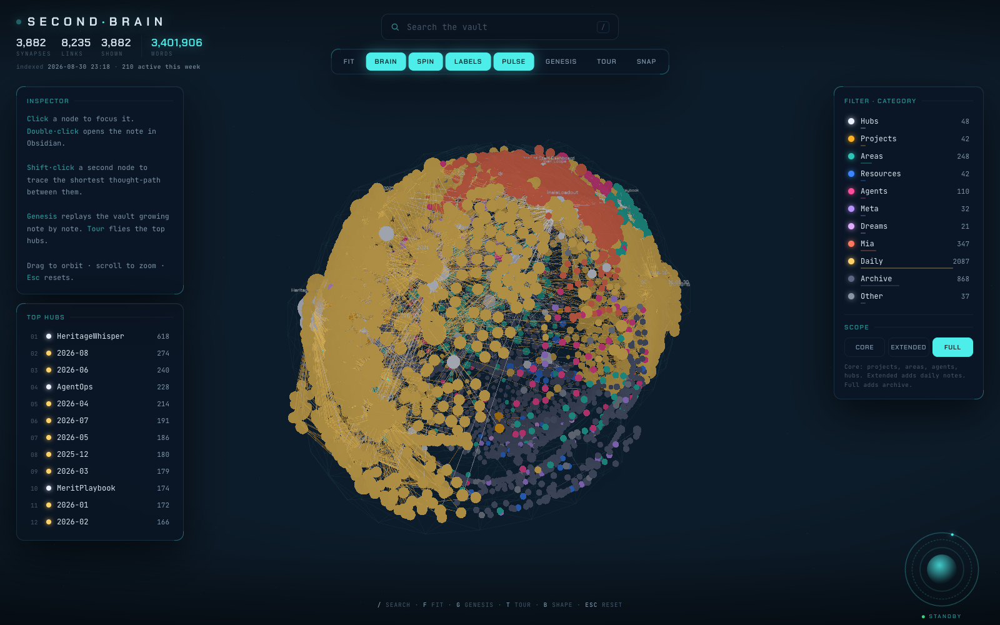

# Second Brain 3D

An interactive 3D neural map of your Obsidian vault, generated as one self-contained HTML file. Your notes become glowing synapses color-coded by folder, your `[[wikilinks]]` become the conduits between them, and the whole graph settles inside a brain silhouette. Grab it, spin it, zoom it, search it, and jump from any node straight into Obsidian.

No plugins, no server, no build step, no network requests. One Python script (standard library only) scans your vault and writes `brain.html`. Open it in any browser.



## Quickstart

You need Python 3.10+ and an Obsidian vault (any folder of `.md` files works).

Option 1, drop it in your vault:

```bash
git clone https://github.com/paultaki/second-brain-3d.git <your-vault>/second-brain-3d
cd <your-vault>/second-brain-3d
python3 generate.py --open
```

Option 2, keep it anywhere and point it at the vault:

```bash
git clone https://github.com/paultaki/second-brain-3d.git
cd second-brain-3d
python3 generate.py --vault ~/path/to/your/vault --open
```

On a Mac you can also double-click `brain.command`. It re-indexes the vault (a few thousand notes take about a second) and opens the map, so the counts are always current.

## Controls

- Drag to orbit, scroll to zoom, `Esc` to reset
- Click a node: focus mode. The focal node blazes, its neighborhood glows, the rest dims, and the inspector lists its connections
- Double-click a node (or the inspector button): opens the note in Obsidian
- Shift-click a second node: traces the shortest thought-path between the two, with a photon riding it hop by hop
- `/` search, `F` fit to view, `B` brain/galaxy toggle, `L` labels, `G` genesis, `T` tour, `P` pulse
- Legend rows: hover previews a category, click toggles it, option-click solos it
- Scope dial: Core (your working notes), Extended (adds daily notes), Full (adds archive)

## Cinematics

- **Genesis** (`G`) replays your vault growing note by note in creation order, with a live date readout. Creation dates come from git first-add history when the vault is a repo, with filesystem birthtime as fallback. A fast version runs on boot; any click dismisses it.
- **Tour** (`T`) flies the camera through your top hubs, at most two per category, with the inspector narrating each stop. Grab the graph to take over.
- **Pulse** (`P`) fires ambient synapses on random links and puts a slow breathing pulse on notes you touched in the last 7 days. Off by default under reduced-motion.
- **Snap** downloads a watermarked PNG share card of the current view.

## Categories and scope

By default every top-level folder in your vault becomes a category, colored by size, with daily/journal folders on the Extended tier and archives on the Full tier. Zero config.

If you want curated groupings (several folders sharing one category, custom colors, custom tiers), fill in `FOLDER_TO_CAT` and `CATEGORIES` at the top of `generate.py`. The file documents both modes.

## Privacy

This tool is built for vaults that contain your actual life, so the rails are strict and fail closed:

- Folders named `90-Private`, `Private`, or `_private` are never walked, read, counted, or emitted, at any depth. This is hardcoded with no flag, and an assertion re-verifies after every scan that nothing slipped through. Add your own names to `PRIVATE_DIR_NAMES`.
- `SENSITIVE_SUBPATHS` lets you list folders that stay out of the map until you explicitly flip `INCLUDE_SENSITIVE_AREAS = True`.
- `brain.html` makes zero network requests. Fonts are embedded in the file.
- The output embeds your vault's folder name (for `obsidian://` deep links) but never its filesystem path.

What `brain.html` does contain: every included note's title, word count, folder, and link structure. Share it the way you'd share a screenshot of your graph view.

## Architecture

- `generate.py`: stdlib-only scanner. Walks the vault, parses `[[wikilinks]]` (alias, heading, and path styles), maps folders to categories, then injects the graph JSON and the vendored JS into the template. Output: `brain.html`, fully self-contained.
- `template.html`: the app. three.js and 3d-force-graph render the graph, an UnrealBloomPass supplies the glow, and a custom containment force (a deformed-sphere radius field) shapes the layout into a brain. The HUD is plain DOM.
- `vendor.min.js`: pinned esbuild bundle of three 0.185.1, 3d-force-graph 1.73.4, and three-spritetext. Rebuild only when bumping versions:

```bash
cd build-vendor && npm install && ./node_modules/.bin/esbuild entry.js --bundle --minify --format=iife --outfile=../vendor.min.js
```

## Performance notes

Tested on a vault of ~3,900 notes and ~8,200 links. Node spheres share one geometry and a small cached set of unlit materials (the bloom pass does the glowing, so there is no per-pixel lighting), the renderer caps its pixel ratio at 1.5, and physics warmup scales down as the graph grows so scope switches stay responsive. Vaults well past 10k notes will still work but the force layout will take longer to settle.

## Credits

Built on [three.js](https://threejs.org) (MIT), [3d-force-graph](https://github.com/vasturiano/3d-force-graph) (MIT), and [three-spritetext](https://github.com/vasturiano/three-spritetext) (MIT) by Vasco Asturiano. Embedded fonts are [Chakra Petch](https://fonts.google.com/specimen/Chakra+Petch) and [JetBrains Mono](https://www.jetbrains.com/lp/mono/), both under the SIL Open Font License.

Companion project: [second-brain](https://github.com/paultaki/second-brain), a one-prompt system that has Claude Code build and maintain the vault this tool visualizes.

## License

MIT. See [LICENSE](LICENSE).
